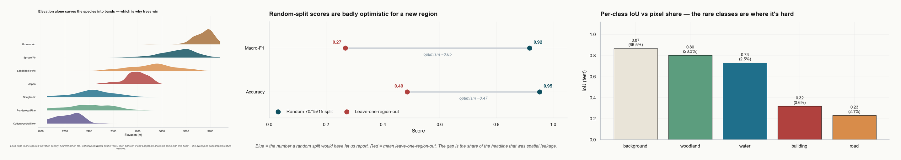
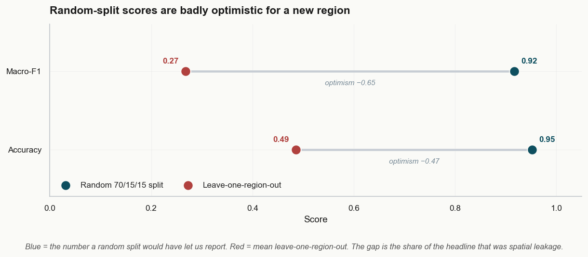
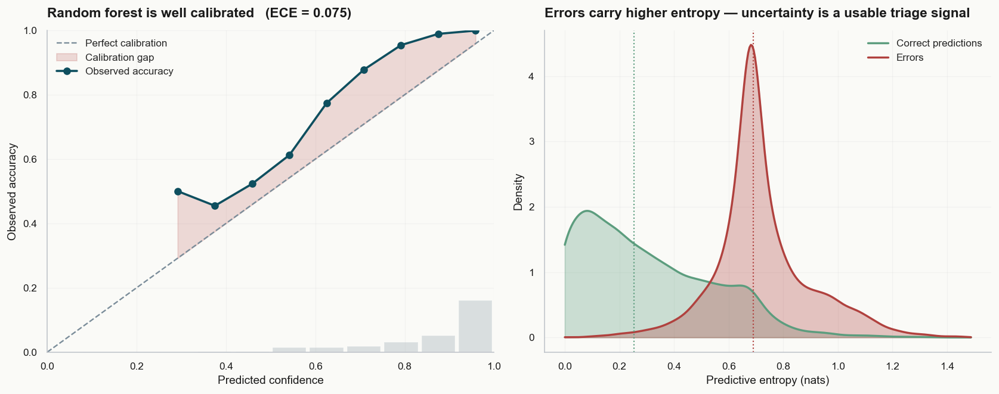
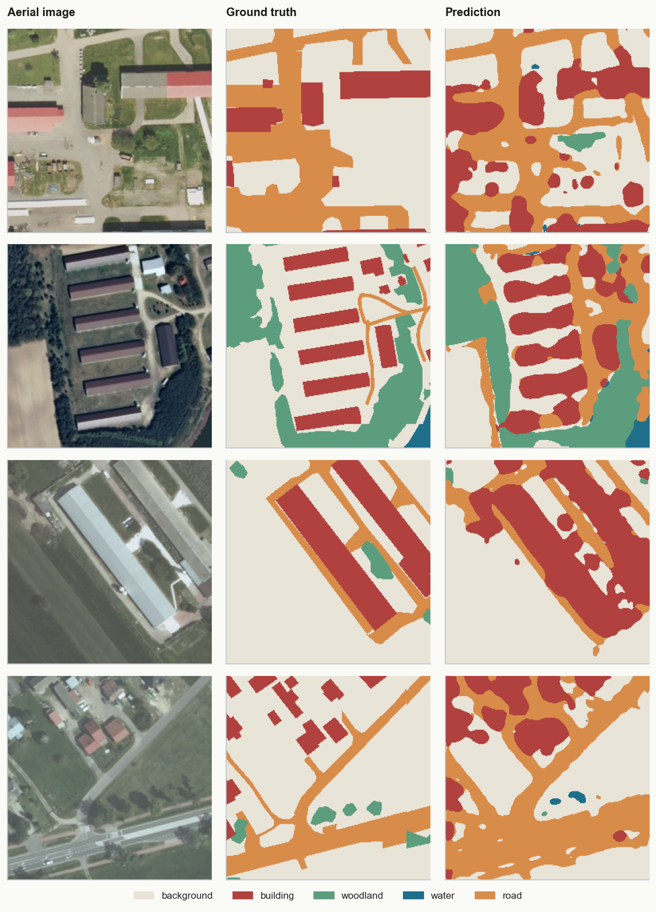
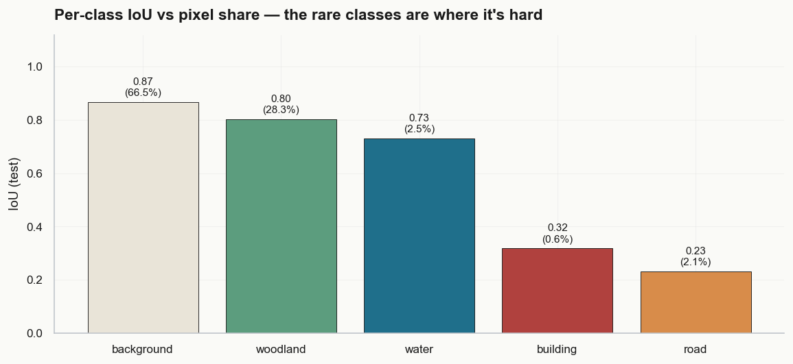

<div align="center">

# 🌲 Forest Cover Type → 🛰️ Land-Cover Segmentation

### A two-pillar data-science portfolio — classical ML & applied statistics on cartographic data, and PyTorch deep-learning segmentation on aerial imagery — held to one standard: *report only what survives an honest test.*

<br>

[](https://www.python.org/)
[](https://pytorch.org/)
[](https://scikit-learn.org/)
[](#-explore-the-notebooks)
[](LICENSE)

<br>



<sub>**Left** — elevation alone carves the species into bands.&nbsp;&nbsp;**Centre** — the headline 95% accuracy is half spatial leakage.&nbsp;&nbsp;**Right** — where pixel-level segmentation gets hard.</sub>

<br>

[**🌲 Pillar 1 · Tabular ML**](#-pillar-1--tabular-land-cover-ml--applied-statistics) &nbsp;·&nbsp; [**🛰️ Pillar 2 · Image Segmentation**](#-pillar-2--deep-learning-segmentation-of-aerial-imagery) &nbsp;·&nbsp; [**📊 Results**](#-results-at-a-glance) &nbsp;·&nbsp; [**🚀 Quickstart**](#-quickstart)

</div>

---

## The question

*What land cover is where — and how trustworthy is the map we draw?*

The same ecological question is answered twice. First with **classical machine learning and applied statistics** on tabular, map-derived covariates; then with **deep-learning semantic segmentation** on raw aerial imagery. Each notebook reads like a short paper: a hypothesis up front, the simplest model first, escalation only when the evidence forces it — and a deliberate, adversarial test of whether the headline number is real.

The throughline is **honesty under imbalance and distribution shift**: refuse the flattering metric, validate against *unseen geography* instead of shuffled neighbours, and name the specific, data-bound reason for the residual error rather than reaching for a bigger model.

## 📊 Results at a glance

| | Pillar 1 · Tabular | Pillar 2 · Imagery |
|---|---|---|
| **Task** | 7-species cover-type classification | 5-class pixel segmentation |
| **Data** | UCI Covertype — 581k patches, 54 covariates | LandCover.ai — 41 aerial orthophotos, 0.25–0.5 m/px |
| **Model** | Random forest *(vs. logistic, PyTorch MLP, GBM)* | PyTorch U-Net, ImageNet ResNet-34 encoder |
| **Headline** | **0.95 acc / 0.92 macro-F1** | **0.59 mIoU / 0.89 pixel-acc** *(held-out scenes)* |
| **The honest catch** | **→ 0.49** acc on an *unseen region* | rare classes (building/road) IoU **0.23–0.32** |
| **Trust tooling** | calibration (ECE 0.075) · entropy triage (confident half = **99.9%**) | per-class IoU · precision/recall · weighted loss |

---

## 🌲 Pillar 1 — Tabular Land-Cover ML & Applied Statistics

📓 [`notebook.ipynb`](notebook.ipynb) — predict a 30 m forest patch's dominant tree species from a DEM and its derivatives, distance rasters, and soil/wilderness polygons.

A hypothesis stated up front, then four model families fit in increasing capacity — logistic regression *(from scratch in NumPy **and** scikit-learn)*, a one-hidden-layer net *(from scratch **and in PyTorch**, curves overlaid as a gradient check)*, and tree ensembles. Random forest wins at **0.95 / 0.92** — exactly inside the predicted band.

Then the part that separates a leaderboard result from a deployable one:

<table>
<tr>
<td width="50%" valign="top">

**🗺️ The number that survives an unseen region**

Forest patches are spatially autocorrelated, so a *random* split lets the model coast on near-neighbours. A **leave-one-wilderness-area-out** validation removes that crutch — accuracy collapses **0.95 → 0.49**, macro-F1 **0.92 → 0.27**. The drop is leakage *and* genuine cross-region distribution shift — both invisible to a random split.

</td>
<td width="50%" valign="top">

**🎯 Does the model know when it's wrong?**

Calibrated probabilities (**ECE 0.075**) plus a predictive-entropy triage rule: the **confident half of predictions is 99.9% accurate**, while the uncertain decile concentrates errors 6× above base rate — a human-in-the-loop pipeline for free.

</td>
</tr>
<tr>
<td></td>
<td></td>
</tr>
</table>

| Model | Test acc | Macro-F1 | Note |
|---|:---:|:---:|---|
| **Random forest** | **0.952** | **0.917** | best; well-calibrated |
| Decision tree | 0.904 | 0.849 | |
| HistGB *(swept)* | 0.911 | ~0.90 | bias-floor, structural gap to RF |
| MLP *(PyTorch)* | 0.749 | 0.509 | accuracy up, macro-F1 *below* linear |
| Logistic *(sklearn)* | 0.726 | 0.537 | the linear floor |

> The macro-F1 column is the read worth memorising — the neural net's higher accuracy hides *worse* minority-class recall, the exact failure mode accuracy-only reporting masks.

## 🛰️ Pillar 2 — Deep-Learning Segmentation of Aerial Imagery

📓 [`segmentation.ipynb`](segmentation.ipynb) — per-pixel land-cover segmentation of 0.25–0.5 m aerial imagery with a **PyTorch U-Net** (hand-built decoder on an ImageNet-pretrained ResNet-34 encoder, transfer learning, discriminative learning rates).

Real geospatial engineering — reconstruct the 512 px tile grid, crop and downsample to 256 px, and split **by whole orthophoto** so test scenes are never seen in training (a true geographic holdout — the imagery analogue of Pillar 1's spatial CV; the published *tile* split would have leaked scenes across folds). The classes are brutally imbalanced (buildings & roads are <2% of pixels), so the model is scored on **per-class IoU/mIoU**, not pixel accuracy, with an inverse-frequency-weighted loss.

<div align="center">

<br>
<sub>Aerial image · ground truth · prediction, on the hardest tiles. The model recovers scene structure cleanly; you can <i>see</i> it over-paint the rare classes — high recall, low precision — exactly what the IoU bars quantify.</sub>
</div>

<table>
<tr>
<td width="58%" valign="middle">

**Honest, legible evaluation** *(on held-out scenes)*. Background and woodland segment well (IoU 0.80–0.87), water trails on this small holdout (0.73); buildings and roads are where it's hard. The confusion is *explainable*: the inverse-frequency loss trades precision for recall on the rare classes — the network **over-paints** them (recall ≈ 0.8–0.9, precision ≈ 0.25–0.35) — and IoU is the single number that nets that trade-off honestly. Validation mIoU was still rising at the budget cap, so more labelled tiles and epochs are the cheapest next lever (an architecture/loss ablation would be the rigorous next step).

| Class | IoU | Recall | Precision |
|---|:---:|:---:|:---:|
| background | 0.87 | 0.89 | 0.98 |
| woodland | 0.80 | 0.88 | 0.90 |
| water | 0.73 | 0.96 | 0.76 |
| building | 0.32 | 0.94 | 0.33 |
| road | 0.23 | 0.83 | 0.24 |

</td>
<td width="42%" valign="middle">

</td>
</tr>
</table>

---

## 🧠 Skills → evidence

| Capability | Where it lives |
|---|---|
| **PyTorch** — training, transfer learning, custom architectures | `seg_models.py` (U-Net) · `models.py` (`TorchMLP`) |
| **DL computer vision** — semantic segmentation on aerial imagery | `segmentation.ipynb` · `seg_*.py` |
| **Geospatial / remote sensing** — raster tiling, mosaic grids, by-region splits | `seg_data.py` · `notebook.ipynb` §4.5 |
| **Classical ML** — tree ensembles, GBM tuning, learning curves | `notebook.ipynb` §3–§4 |
| **Applied statistics** — spatial sampling, calibration, uncertainty, rare-class metric design | `notebook.ipynb` §4.5–§4.6 |
| **From-scratch fundamentals** — softmax & backprop in NumPy, gradient-checked vs PyTorch | `models.py` |
| **Reproducible engineering** — seeded, cached datasets, clean module separation | all helper modules |

## 🚀 Quickstart

```bash
git clone https://github.com/Ahmad-Jaradat-Space/forest-cover-type.git
cd forest-cover-type
python3.12 -m venv .venv && source .venv/bin/activate
pip install -r requirements.txt
jupyter notebook        # open either notebook
```

Each notebook downloads its data on first run into a git-ignored `data/` folder (Covertype ≈ 11 MB; LandCover.ai ≈ 1.5 GB, tiled and cached on first use). Tested on macOS / Apple-Silicon **MPS**; runs on CUDA or CPU too.

### 📓 Explore the notebooks

Both are committed **already executed**, so GitHub renders every figure inline — read them end to end without running anything.

- 🌲 [`notebook.ipynb`](notebook.ipynb) — tabular ML + applied statistics
- 🛰️ [`segmentation.ipynb`](segmentation.ipynb) — PyTorch aerial-imagery segmentation

## 🗂️ Repository

```
notebook.ipynb        Pillar 1 — tabular land-cover ML + applied statistics
segmentation.ipynb    Pillar 2 — PyTorch aerial-imagery segmentation
├─ data.py  models.py  plots.py            helpers for Pillar 1
└─ seg_data.py  seg_models.py  seg_plots.py helpers for Pillar 2
requirements.txt      pinned dependencies
assets/               figures used in this README
```

## 📊 Data & credits

- **Covertype** — Blackard, Dean & Anderson · US Forest Service / [UCI ML Repository](https://archive.ics.uci.edu/dataset/31/covertype).
- **LandCover.ai** — Boguszewski et al., 2021 · [project site](https://landcover.ai.linuxpolska.com/) · 41 hand-labelled aerial orthophotos of Poland at 0.25–0.5 m/px *(CC-BY-NC-SA)*.

<div align="center">
<br>
<sub>Built by <b>Ahmad Jaradat</b> · MIT licensed · figures generated by the notebooks in this repo</sub>
</div>
